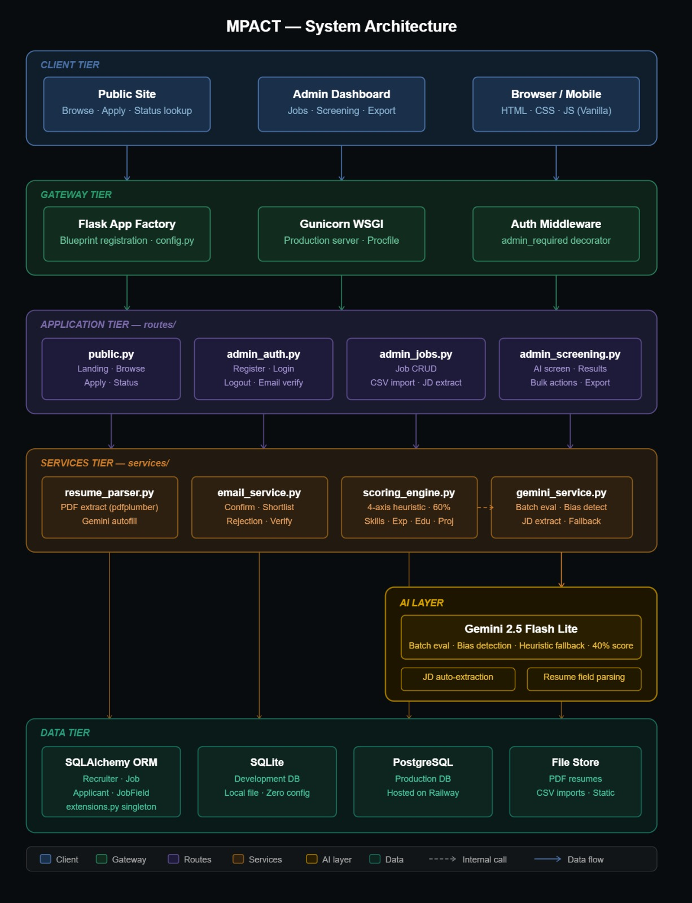
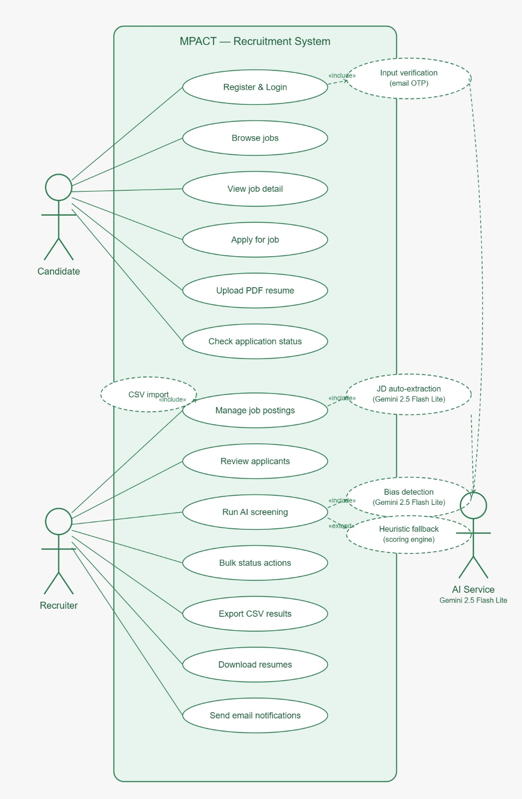
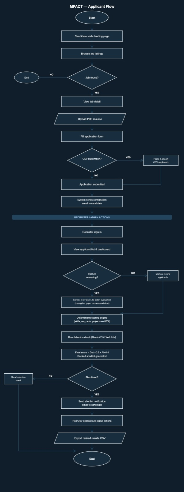
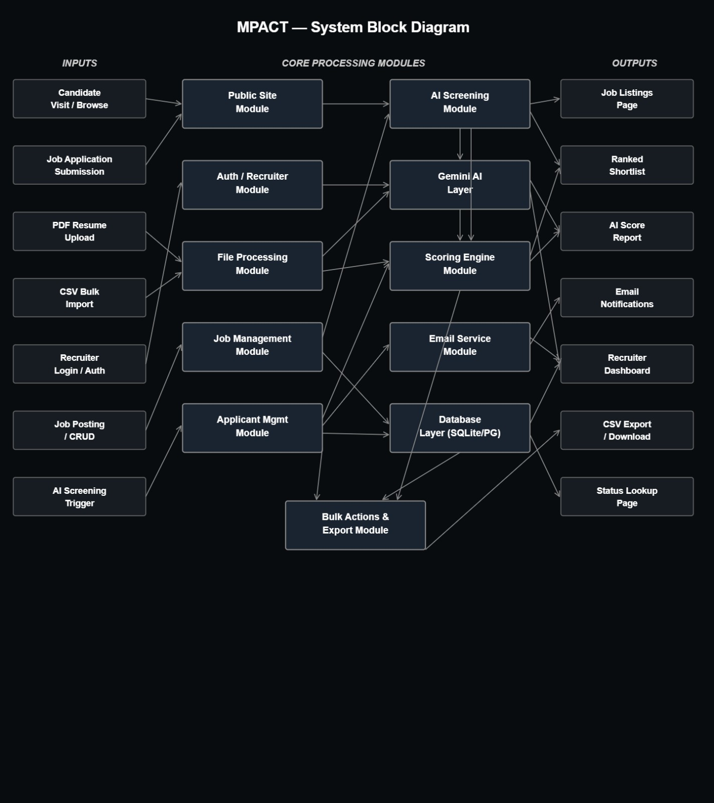
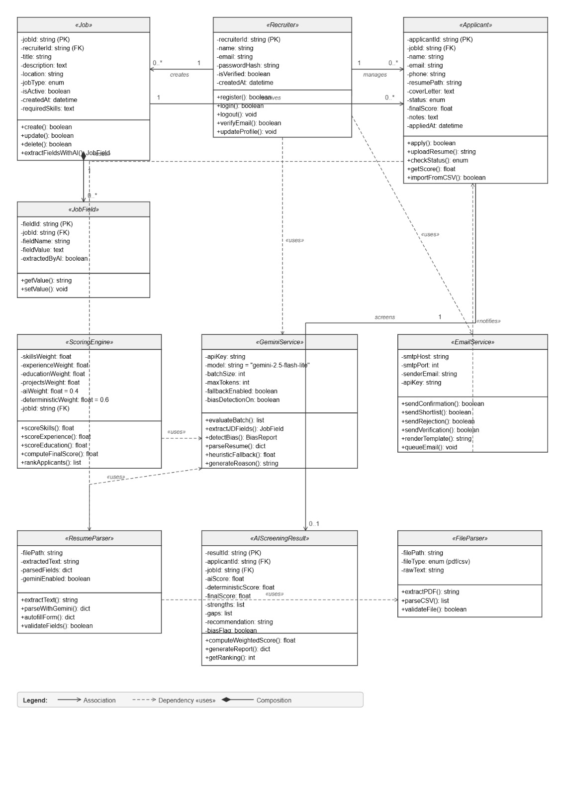
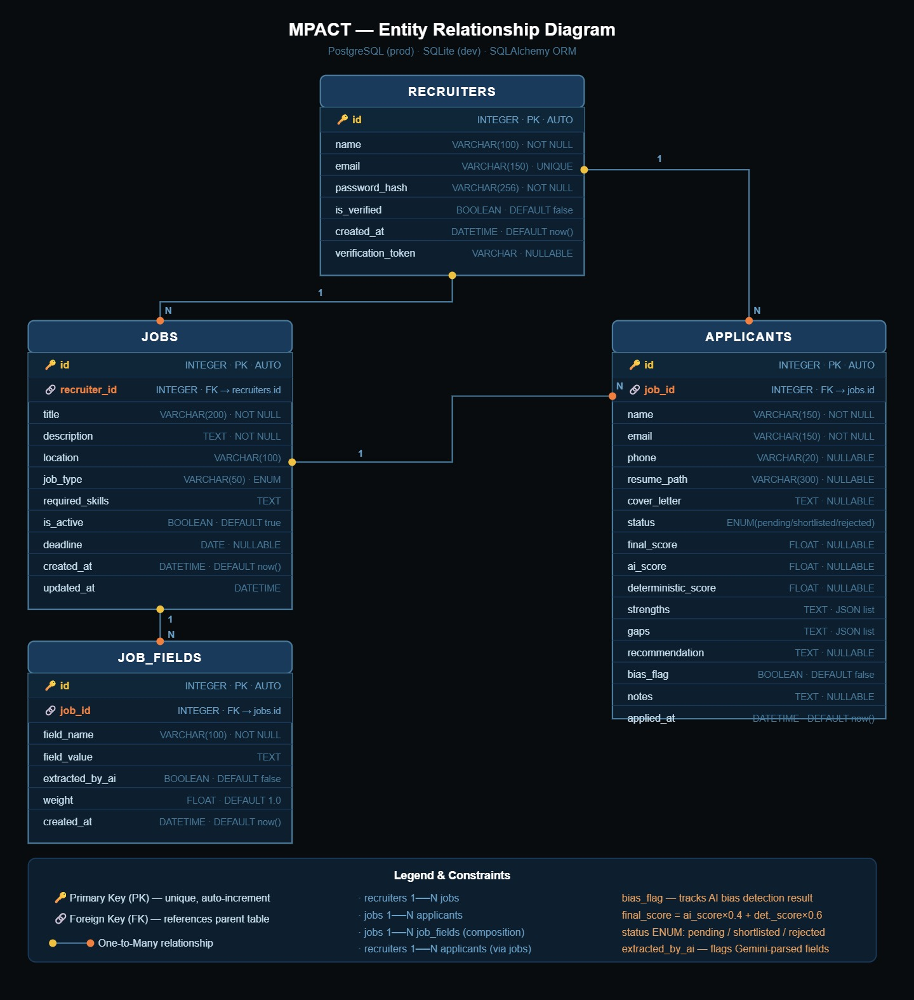

# Mpact — Intelligent Recruiter Screening Platform

> **Umurava AI Hackathon 2026** · Team M&P — Mugisha Kayishema & Principie Cyubahiro · Kigali, Rwanda

**Public URL:** [mpact.principie.tech](https://mpact.principie.tech) Or [mpact.up.railway.app](https://mpact.up.railway.app)

**Demo Video:** [https://youtu.be/Jiw7XQ3IawI](https://youtu.be/Jiw7XQ3IawI)

Mpact is a full-stack recruiting platform that automates candidate screening using a transparent two-layer scoring system, deterministic heuristics combined with Gemini AI then surfaces a ranked shortlist with complete explainability for every decision. Built specifically for African hiring teams.

---

## The Problem

Hiring teams in Africa receive dozens to hundreds of applications per role. Manual screening is slow, inconsistent, and susceptible to unconscious bias. Recruiters spend most of their time reading CVs before any real evaluation even begins.

Mpact solves this by automating the first-pass screening: every applicant is scored across four axes, evaluated by Gemini AI, and ranked in a shortlist with full reasoning in seconds, not days.

---

## Why Flask Instead of Next.js

The Umurava brief permits alternative stacks with justification. We chose Python + Flask for a combination of technical, ecosystem, and team-fit reasons.

### Team expertise

Both team members are most comfortable in Python. Principie Cyubahiro, the lead developer, has years of hands-on Python experience across multiple production and personal projects — spanning web APIs, automation tooling, data pipelines, and AI integrations. Mugisha Kayishema brings complementary Python experience on the backend and data side. Choosing a stack we know deeply meant we could spend hackathon time building features instead of debugging unfamiliar tooling. Reaching for Next.js would have introduced React, TypeScript, and Node.js module resolution friction at exactly the moment when speed mattered most.

### Technical justification

1. **Python owns the AI ecosystem.** Google's `google-generativeai` SDK, `pdfplumber`, and prompt engineering patterns are first-class in Python. Equivalent Node.js wrappers lag behind in API surface and documentation quality. Working directly with the official SDK meant zero translation layer between our prompts and the model.

2. **Zero build pipeline.** Jinja2 server-side templates eliminate the hydration complexity of SSR React. There is no webpack config, no ESBuild, no separate frontend dev server, and no client/server state synchronization to manage. The entire UI is produced by one Python process — simpler to deploy, simpler to debug.

3. **Hackathon velocity.** SQLAlchemy + Flask Blueprints let a two-person team ship all CRUD operations, AI orchestration, PDF parsing, CSV ingestion, bulk status actions, and transactional email in hours rather than days. Flask's minimal surface area means less framework ceremony and more time on product.

4. **Gemini remains central.** `gemini-2.5-flash-lite` is invoked through the official Python SDK throughout — batch candidate evaluation, resume field extraction, JD auto-extraction, and bias detection all run through the same client. The Python SDK is always in sync with the latest model capabilities and API changes.

5. **SQLite → PostgreSQL with no code changes.** SQLAlchemy's dialect abstraction means local development runs on a zero-setup SQLite file and production runs on Railway's PostgreSQL instance. Switching a single environment variable (`DATABASE_URL`) is the only change required between environments.

### Architectural equivalence

The structure deliberately mirrors the recommended stack so the codebase is familiar to anyone coming from Next.js:

| Flask (this project) | Next.js equivalent |
|---|---|
| Blueprint route files | `pages/` and `app/api/` routes |
| Flask-SQLAlchemy models | Prisma schema |
| Jinja2 templates | React components |
| `services/` layer | server actions / service modules |
| `config.py` | `next.config.js` + environment variables |

The separation of concerns — public routes, admin routes, AI services, email services, database models — would translate cleanly to a Next.js rewrite if one were ever needed.

---

## Architecture

```
┌──────────────────────────────────────────────────────────────────────┐
│                      MPACT — System Overview                         │
├──────────────────┬────────────────────────────┬──────────────────────┤
│  PUBLIC SITE     │   ADMIN / RECRUITER         │   AI LAYER           │
│                  │                             │                      │
│  Landing Page    │  Recruiter Auth             │  Gemini 2.5 Flash Lite│
│  Job Browse      │  Dashboard + Stats          │                      │
│  Job Detail      │  Job CRUD                   │  Batch Evaluation    │
│  Apply Form      │  Applicant Management       │  JD Auto-Extraction  │
│  PDF Resume      │  AI Screening               │  Bias Detection      │
│  CSV Import      │  Ranked Results             │                      │
│  Status Lookup   │  Bulk Status Actions        │  Heuristic Fallback  │
│                  │  Resume Download            │                      │
│                  │  CSV Export                 │                      │
└──────────────────┴────────────────────────────┴──────────────────────┘
         │                     │                          │
         └───────────┬─────────┘                          │
                     ▼                                    ▼
           ┌──────────────────┐             ┌──────────────────────────┐
           │  SQLite (dev)    │             │  services/               │
           │  PostgreSQL (prod)│            │  ├── gemini_service.py   │
           │                  │             │  ├── scoring_engine.py   │
           │  recruiters      │             │  ├── email_service.py    │
           │  jobs            │             │  ├── resume_parser.py    │
           │  applicants      │             │  └── file_parser.py      │
           │  job_fields      │             └──────────────────────────┘
           └──────────────────┘
```

### Project Structure

```
mpact/
├── app.py                    Flask application factory + blueprint registration
├── config.py                 Environment-based configuration
├── models.py                 Recruiter, Job, Applicant, JobField SQLAlchemy models
├── extensions.py             SQLAlchemy singleton
├── Procfile                  Gunicorn production entrypoint
├── requirements.txt          Python dependencies
│
├── routes/
│   ├── __init__.py           admin_required decorator
│   ├── public.py             Landing, job browse, job detail, apply form, status lookup
│   ├── admin_auth.py         Recruiter register, login, logout, email verification
│   ├── admin_jobs.py         Job CRUD, CSV import
│   └── admin_screening.py    AI screening, results, JD extraction, CSV export, bulk actions, notes
│
├── services/
│   ├── gemini_service.py     Batch AI evaluation, bias detection, JD extraction
│   ├── scoring_engine.py     Deterministic 4-axis scoring engine
│   ├── email_service.py      Candidate email notifications (application, shortlist, rejection)
│   ├── email.py              Recruiter verification email
│   ├── resume_parser.py      PDF resume field extraction with Gemini
│   └── file_parser.py        PDF text extraction via pdfplumber
│
├── templates/
│   ├── public/               Candidate-facing pages (landing, jobs, apply, status)
│   ├── admin/                Recruiter dashboard (screening, results, jobs, auth)
│   └── icons.html            Inline SVG icon macros — zero CDN dependency
│
└── static/
    ├── css/styles.css        Full custom design system (~900 lines, Stripe-inspired)
    └── js/
        ├── app.js            Public JS (toasts, animations, resume autofill)
        └── admin.js          Admin JS (candidate drawer, scoring rings, bulk select)
```

---

## Diagrams

Five diagrams cover the system from different angles — behavioural, structural, and deployment. Each was drawn to match the actual code, not an idealised spec.

---

### 1. System Architecture



The architecture is split into five named tiers, reflecting how requests actually flow through the application:

- **Client Tier** — Three surfaces share the same backend: the public candidate site (browse, apply, status lookup), the admin recruiter dashboard (jobs, screening, export), and any browser or mobile client. All rendering uses server-side Jinja2; no separate frontend process.
- **Gateway Tier** — Every request enters through the Flask application factory (`app.py`), which registers all blueprints. In production, Gunicorn WSGI sits in front as defined in the `Procfile`. The `admin_required` decorator in `routes/__init__.py` acts as the auth middleware, enforcing session checks before any recruiter route is served.
- **Application Tier (`routes/`)** — Four blueprint files divide the surface area cleanly: `public.py` for all candidate-facing pages, `admin_auth.py` for recruiter registration/login/email verification, `admin_jobs.py` for job CRUD and CSV import, and `admin_screening.py` for AI screening, ranked results, bulk actions, and CSV export.
- **Services Tier (`services/`)** — Business logic lives here, separate from routing. `resume_parser.py` handles PDF text extraction via `pdfplumber` and Gemini-powered field autofill. `email_service.py` sends candidate confirmation, shortlist, and rejection emails. `scoring_engine.py` runs the deterministic 4-axis heuristic (60% weight). `gemini_service.py` orchestrates batch AI evaluation, bias detection, JD field extraction, and the heuristic fallback.
- **AI Layer** — `gemini-2.5-flash-lite` is the single model used for all AI tasks: batch candidate evaluation (strengths, gaps, recommendation), bias detection flags, JD auto-extraction from pasted text, and resume field parsing. These are four distinct prompt patterns in `gemini_service.py`, all hitting the same model endpoint.
- **Data Tier** — SQLAlchemy ORM with a single model file (`models.py`) defines four tables: `Recruiter`, `Job`, `Applicant`, `JobField`. SQLite is used locally with zero configuration; a `DATABASE_URL` environment variable switches the dialect to PostgreSQL on Railway for production. Uploaded PDF resumes and CSV imports are stored on the local filesystem under `instance/uploads/`.

---

### 2. Use Case Diagram



The diagram identifies three actors and maps every interaction in the system:

**Candidate** initiates six use cases: registering and logging in, browsing published job listings, viewing a job's detail page, submitting an application form, uploading a PDF resume, and checking their application status using their reference number and email. Registration includes an email verification step (labelled "Input verification (email OTP)") that connects to the AI Service actor — in practice this is the Resend API sending a verification link, though the diagram uses the generic "AI Service" boundary for all external integrations.

**Recruiter** initiates seven use cases: managing job postings (which includes CSV bulk import as an `<<include>>` extension, and JD auto-extraction via Gemini as a second `<<include>>`), reviewing individual applicants, running AI screening (which includes Bias Detection via Gemini and extends to a Heuristic Fallback when Gemini is unavailable), applying bulk status actions across selected candidates, exporting ranked results as CSV, downloading individual resumes, and triggering email notifications.

**AI Service (Gemini)** appears as a right-hand actor with three inbound connections: JD auto-extraction, bias detection during screening, and input verification. This correctly models Gemini as an external dependency that the system calls rather than controls.

The `<<extend>>` relationship on Heuristic Fallback is particularly important: it fires only when the primary Gemini call fails, which is the correct UML semantics for an optional extension point. This matches the fallback logic in `gemini_service.py`.

---

### 3. Applicant Flow



A flowchart that traces the full lifecycle of a hiring round from first candidate visit to final export. It is divided into two clear sections by a horizontal divider labelled **RECRUITER / ADMIN ACTIONS**.

**Candidate section (top half):**
The flow starts at the landing page, moves to job browsing, and branches on whether a suitable job is found (NO → End). If a job is found, the candidate views the detail page, optionally uploads a PDF resume, and fills in the application form. A second branch handles CSV bulk import — if the recruiter is importing from LinkedIn or Indeed rather than accepting individual applications, the CSV is parsed and applicants are created directly. Both paths converge at "Application submitted," after which the system automatically sends a confirmation email to the candidate with their reference number.

**Recruiter section (bottom half):**
The recruiter logs in and views the applicant list and dashboard stats. A decision diamond asks whether to run AI screening:
- **NO branch** → Manual review of applicants (no scoring, recruiter reads profiles directly).
- **YES branch** → Three sequential processing steps: Gemini 2.5 Flash lite batch evaluation (produces strengths, gaps, recommendation per candidate), then the deterministic scoring engine (4-axis heuristic covering skills, experience, education, projects — weighted at 60%), then a bias detection check via Gemini. These combine into the final score formula (`AI × 0.4 + Weighted × 0.6`) and a ranked shortlist is generated.

After screening, another decision diamond: **Shortlisted?**
- **YES** → Send shortlist notification email → Recruiter applies bulk status actions → Export ranked results as CSV → End.
- **NO** → Send rejection email (the rejection branch is shown leaving the left side of the diamond).

---

### 4. System Block Diagram



A high-level input/output view of the system, useful for understanding data flow without implementation detail.

**Inputs (left column, 7 sources):**
Candidate Visit / Browse, Job Application Submission, PDF Resume Upload, CSV Bulk Import, Recruiter Login / Auth, Job Posting / CRUD, and AI Screening Trigger. These represent every external action that causes the system to do something.

**Core Processing Modules (centre, two columns):**
The left column contains the user-facing modules — Public Site Module, Auth / Recruiter Module, File Processing Module, Job Management Module, and Applicant Management Module. These correspond directly to the five blueprint files in `routes/` plus the file handling in `services/`. The right column contains the backend processing modules — AI Screening Module, Gemini AI Layer, Scoring Engine Module, Email Service Module, and Database Layer (SQLite/PostgreSQL). A sixth module, Bulk Actions & Export, sits at the bottom centre as a cross-cutting concern that draws from both columns.

The dense arrow network between modules reflects that this is not a pipeline — it is a mesh. The database is written to by almost every module; the AI Screening Module consults both the Gemini AI Layer and the Scoring Engine; Email is triggered from both candidate actions and recruiter bulk actions.

**Outputs (right column, 7 results):**
Job Listings Page, Ranked Shortlist, AI Score Report, Email Notifications, Recruiter Dashboard, CSV Export / Download, and Status Lookup Page. Every output traces back to at least two input paths, which is what makes the cross-module arrow density appropriate.

---

### 5. Class Diagram



Ten classes covering domain entities, service modules, and result objects. The diagram uses UML stereotypes (`«Job»`, `«Recruiter»`, etc.) to signal that these are not arbitrary classes but domain-layer objects.

**Domain entities:**
- `«Recruiter»` — PK, credentials (passwordHash), `isVerified` flag, and four methods covering the auth lifecycle. One recruiter creates zero-or-more jobs (1 → 0..*).
- `«Job»` — Stores the posting data including `requiredSkills` as text, configurable `jobType` enum, and an `extractFieldsWithAI()` method that calls Gemini to parse a pasted JD into structured `JobField` records. One job has zero-or-more `JobField` entries (composition).
- `«JobField»` — Represents a single extracted field from the JD (e.g., required experience, seniority level). The `extractedByAI` boolean tracks whether the value came from Gemini extraction or recruiter manual entry.
- `«Applicant»` — Stores the candidate profile, `resumePath`, `status` enum (new/reviewed/shortlisted/interview/rejected), `finalScore`, and recruiter `notes`. Key methods include `importFromCSV()` (for bulk ingestion) and `checkStatus()` for the self-service status page.

**Service classes:**
- `«ScoringEngine»` — Holds the four configurable axis weights plus the fixed `aiWeight = 0.4` and `deterministicWeight = 0.6` constants. Its `rankApplicants()` method produces the sorted shortlist.
- `«GeminiService»` — API key, model name, batch size, and two capability flags (`fallbackEnabled`, `biasDetectionOn`). Six methods cover every Gemini use case: `evaluateBatch()`, `extractJDFields()`, `detectBias()`, `parseResume()`, `heuristicFallback()`, and `generateReason()`.
- `«EmailService»` — Holds transport configuration (SMTP host/port or Resend API key). Five send methods correspond to the five email events in the system.
- `«ResumeParser»` — Wraps `FileParser` and adds Gemini-powered field extraction. The `geminiEnabled` flag controls whether `parseWithGemini()` or plain text extraction is used.
- `«FileParser»` — Low-level file handling. Supports PDF (via pdfplumber) and CSV. Separate from `ResumeParser` so CSV import can use it directly without going through the resume parsing chain.
- `«AIScreeningResult»` — A result object (not a database model, but a transient object) that holds the merged output of both scoring layers: `aiScore`, `deterministicScore`, `finalScore`, `strengths` (list), `gaps` (list), `recommendation` string, and `biasFlag` boolean.

**Key relationships:**
`ScoringEngine` uses `GeminiService` (dashed dependency) — it delegates the AI portion of scoring. `GeminiService` produces `AIScreeningResult` (0..1 per applicant). `ResumeParser` uses `FileParser` for raw text extraction. `Recruiter` manages `Applicant` (association, 1 to 0..*) — recruiters own the screening decisions, not the applications.

---

### 6. Entity Relationship Diagram



The ERD shows the physical database structure: four tables, their column types and constraints, and the relationships that enforce data integrity. The subtitle reads *PostgreSQL (prod) · SQLite (dev) · SQLAlchemy ORM*, reflecting that the same schema runs on both engines without any code changes.

**RECRUITERS**
The root of the ownership model. Every job and every applicant traces back to a recruiter through the foreign key chain. Key columns: `email` is `VARCHAR(150) · UNIQUE` — one account per email address, enforced at the database level. `password_hash` is `VARCHAR(256) · NOT NULL` — passwords are never stored in plaintext. `is_verified` is `BOOLEAN · DEFAULT false` — a recruiter cannot access the dashboard until email verification sets this to `true`. `verification_token` is `VARCHAR · NULLABLE` — populated when a verification email is sent, cleared once the token is consumed.

**JOBS**
Linked to RECRUITERS via `recruiter_id` (FK → recruiters.id). This is the ownership link — when a recruiter logs in, the system queries `WHERE recruiter_id = session_recruiter_id` so recruiters only ever see their own jobs. Notable columns: `required_skills TEXT` stores a comma-separated skill list that the scoring engine tokenizes for matching. `is_active BOOLEAN · DEFAULT true` controls whether the job appears on the public listings page. `job_type VARCHAR(50) · ENUM` stores employment type (Full-time, Contract, etc.).

**APPLICANTS**
Linked to JOBS via `job_id` (FK → jobs.id). The cardinality shown is `jobs 1——N applicants` and also `recruiters 1——N applicants (via jobs)` — the ERD correctly notes the indirect relationship. Screening output columns sit directly on this table: `final_score FLOAT · NULLABLE` (null until screening runs), `ai_score FLOAT · NULLABLE`, `deterministic_score FLOAT · NULLABLE`. The `strengths` and `gaps` columns are `TEXT · JSON list` — Gemini's output is serialised as JSON and stored here. `bias_flag BOOLEAN · DEFAULT false` is set by Gemini's bias detection pass. `status ENUM` tracks pipeline stage: `pending / shortlisted / rejected`. The constraint annotation in the legend makes the scoring formula explicit: `final_score = ai_score × 0.4 + det_score × 0.6`.

**JOB_FIELDS**
The composition table for custom application questions and AI-extracted JD fields. Linked to JOBS via `job_id` (FK → jobs.id) with `jobs 1——N job_fields (composition)` — if a job is deleted, its fields are cascade-deleted. `extracted_by_ai BOOLEAN · DEFAULT false` distinguishes fields the recruiter created manually from fields Gemini extracted from a pasted job description. `weight FLOAT · DEFAULT 1.0` allows individual fields to carry different scoring importance.

**Relationships summary (from the legend):**
- `recruiters 1——N jobs` — one recruiter owns many jobs
- `jobs 1——N applicants` — one job receives many applications
- `jobs 1——N job_fields` (composition) — job fields are owned by and deleted with the job
- `recruiters 1——N applicants` (via jobs) — indirect but enforced by the FK chain

---

## Quick Start

```bash
# 1. Clone and enter the project
git clone <repo-url>
cd mpact

# 2. Create virtual environment
python -m venv .venv
source .venv/bin/activate       # Windows: .venv\Scripts\activate

# 3. Install dependencies
pip install -r requirements.txt

# 4. Configure environment
cp .env.example .env
# Edit .env — minimum required: GEMINI_API_KEY
# Without it, the heuristic fallback runs automatically — the demo still works

# 5. Seed demo data (recommended)
python seed.py
# Creates 4 jobs and 12 Rwandan candidate profiles

# 6. Run the development server
python app.py
```

Open [http://localhost:5000](http://localhost:5000) for the candidate-facing site.

Recruiter dashboard: [http://localhost:5000/recruiter/login](http://localhost:5000/recruiter/login)

Register a recruiter account, verify your email, and you're in.

---

## Environment Variables

| Variable | Required | Default | Description |
|---|---|---|---|
| `FLASK_SECRET_KEY` | Yes (prod) | `mpact-dev-secret` | Session encryption key |
| `GEMINI_API_KEY` | Recommended | — | Google AI API key — enables real AI screening |
| `GEMINI_MODEL` | No | `gemini-2.5-flash-lite` | Gemini model ID |
| `DATABASE_URL` | Yes (prod) | SQLite local | PostgreSQL connection string |
| `RESEND_API_KEY` | For email | — | Resend API key for transactional email |
| `MAIL_SERVER` | For email | — | SMTP server (alternative to Resend) |
| `MAIL_PORT` | For email | `587` | SMTP port |
| `MAIL_USERNAME` | For email | — | SMTP username |
| `MAIL_PASSWORD` | For email | — | SMTP password |
| `MAIL_FROM` | For email | — | Sender email address |

> **Email transport priority:** Resend API → SMTP → silent fallback with console log. The app runs fully without email configured; a verification link is shown on screen during development.

---

## AI Decision Flow

When a recruiter triggers screening, every applicant for that job passes through the following steps in order:

1. **Deterministic scoring** — `scoring_engine.py` computes four axis scores (skills, experience, education, projects) using the job's configured weights. This runs entirely offline, no API call needed.
2. **Gemini batch evaluation** — `gemini_service.py` builds a single prompt containing the job description and all applicant summaries, then makes one API call to `gemini-2.5-flash-lite`. The response is a JSON array — one evaluation object per candidate.
3. **Score blending** — Each candidate's final score is computed: `Final = Weighted × 0.6 + AI × 0.4`.
4. **Bias detection** — Gemini's response includes a `bias_flag` field per candidate. Flagged candidates surface a ⚠ warning in the UI prompting the recruiter to review that decision manually.
5. **Ranking** — Candidates are sorted by final score descending. The recruiter selects Top 10, 20, or 50 as their shortlist.
6. **Human decision** — Recruiters review the ranked list, read per-candidate AI reasoning and gap analysis, add notes, and assign statuses. No candidate is automatically rejected or shortlisted without a human action.

If the Gemini batch call fails (quota exceeded, network error), the system retries with individual per-candidate calls. If Gemini is entirely unavailable, a deterministic heuristic in `gemini_service.py` produces the same JSON schema — skills intersection, experience ratio, education level — so the demo always works without an API key.

### Two-Layer Architecture

Every applicant is scored through two independent layers. The final score blends both.

```
                   ┌────────────────────────────────────────┐
                   │          MPACT SCORING ENGINE           │
                   └───────────────┬────────────────────────┘
                                   │
             ┌─────────────────────┼─────────────────────┐
             ▼                                           ▼
  ┌──────────────────────┐                 ┌──────────────────────┐
  │   DETERMINISTIC 60%  │                 │     GEMINI AI  40%   │
  │                      │                 │                      │
  │  Skills Match        │                 │  Batch evaluation    │
  │  Experience Score    │                 │  Strengths (3–5)     │
  │  Education Score     │                 │  Gaps (2–4)          │
  │  Projects Score      │                 │  Recommendation      │
  │                      │                 │  Reasoning (2–3 sen) │
  │  Configurable        │                 │  Bias flag + notes   │
  │  weights per job     │                 │                      │
  └──────────┬───────────┘                 └──────────┬───────────┘
             │                                        │
             └──────────────────┬─────────────────────┘
                                ▼
                 Final Score = Weighted × 0.6 + AI × 0.4
                                ▼
                    Ranked Shortlist (Top 10 / 20 / 50)
```

### Scoring Formulas

```
Skills Score     = (matched_required_skills / total_required) × 100
                   Token-based matching avoids false positives ("Go" ≠ "PostgreSQL")

Experience Score = ratio ≥ 1.5×  → 100
                   ratio ≥ 1.0×  → 85 + (ratio − 1) × 30
                   ratio < 1.0×  → max(20, ratio × 80)

Education Score  = level_weight[level]   (PhD=100, Masters=85, Bachelors=70, Diploma=50)
                   × 0.6 penalty if below required level

Projects Score   = 30 + (project_count × 14), capped at 100

Weighted Score   = Σ(axis_score × weight) / 100    (weights sum to 100, recruiter-configurable)

Final Score      = Weighted × 0.6 + AI_Score × 0.4
```

### Batch Evaluation

All candidates for a job are sent to Gemini in a **single API call**, returning a JSON array with all evaluations simultaneously. This is significantly faster than sequential calls and satisfies the hackathon requirement for multi-candidate evaluation in a single prompt.

```python
# services/gemini_service.py
results = analyze_batch(job, all_applicants, weighted_scores)
# One Gemini call → dict[applicant_id → {ai_score, strengths, gaps, recommendation, reasoning, bias_flag}]
```

If the batch call fails (quota, network), the system automatically falls back to individual calls per candidate. If Gemini is entirely unavailable, a deterministic heuristic produces the same JSON schema using skill intersection, experience ratios, and education level — ensuring the demo always works without an API key.

### Bias Detection

Gemini flags potential unconscious bias signals in each candidate's profile:
- Name-based cultural or ethnic bias
- Location or institution prestige bias
- Experience gap interpretations that may disadvantage non-traditional career paths

Flagged candidates display a ⚠ indicator on result cards and in the candidate detail drawer, prompting recruiters to review those decisions more carefully before acting.

---

## Email Notifications

The platform sends transactional emails at three key moments:

| Event | Recipient | Content |
|---|---|---|
| Recruiter registers | Recruiter | Email verification link |
| Candidate applies | Candidate | Confirmation with reference number + next steps |
| New application received | Recruiter | Alert with candidate details + dashboard link |
| Candidate shortlisted | Candidate | Shortlist notification |
| Candidate rejected | Candidate | Respectful rejection with encouragement |

All emails are built as responsive HTML with a plain-text fallback. The system tries Resend API first, then SMTP, then logs the link to console for development.

---

## Candidate Features

### Application Form
- Full profile with skills, experience, education, projects, location
- PDF resume upload (up to 16 MB) with automatic text extraction
- Resume autofill: upload a PDF and Gemini parses all fields automatically
- Custom questions per job (text, textarea, yes/no, select)
- Structured talent profile compatible with Umurava's schema (headline, bio, availability, LinkedIn, GitHub, portfolio)

### Application Status Page
Candidates can look up their application status at any time using their email address and reference number (format: `MPT-0001-00001`). The status page shows:
- Current stage in the hiring pipeline
- Visual progress timeline
- Contextual messages for shortlisted and interview-stage candidates

---

## Recruiter Features

### Dashboard
- Stats at a glance: total jobs, total applicants, screened, shortlisted, average score
- Recent activity feed across all jobs

### Job Management
- Create, edit, publish, and unpublish jobs
- Configurable scoring weights per job (skills / experience / education / projects — must sum to 100)
- Custom application questions (up to 10 per job)

### Candidate Screening
- Run AI screening on all applicants for a job with a single click
- Real-time progress modal with step-by-step status
- Ranked results table with score breakdown (skills, experience, education, projects, weighted, AI, final)
- Candidate detail drawer: full profile, structured experience timeline, certifications, AI reasoning, bias notes
- Inline recruiter notes per candidate
- Status management: new → reviewed → shortlisted → interview → rejected
- **JD auto-extraction:** paste any job description into the screening page and Gemini extracts structured requirements (skills, experience level, education) automatically — no manual form filling needed

### Bulk Actions
- Select multiple candidates and update status in one action
- Bulk shortlist triggers automatic email notifications to all selected candidates

### CSV Import
- Import applicants from any CSV or TSV file (LinkedIn exports, Indeed, ATS exports)
- Flexible column mapping — the system auto-detects common header formats
- Imported candidates run through the full AI screening pipeline

### CSV Export
- Export ranked results as CSV for sharing with hiring managers
- Includes all scores, AI strengths, gaps, reasoning, bias flags, and status

---

## Functional Coverage

### Scenario 1 — Umurava Platform Profiles
- ✅ Job creation with required skills, experience, education, seniority
- ✅ Structured talent profile ingestion (Umurava schema: headline, bio, skills with proficiency, experience timeline, education, certifications, projects, languages, availability)
- ✅ PDF resume upload with automatic text extraction and field autofill
- ✅ AI batch screening → ranked Top 10/20/50
- ✅ Per-candidate: score breakdown, strengths, gaps, AI reasoning, bias flag
- ✅ Configurable scoring weights per job

### Scenario 2 — External Job Boards
- ✅ CSV/TSV file upload with flexible column mapping
- ✅ Supports LinkedIn exports, Indeed CSVs, custom ATS exports
- ✅ Imported candidates run through the same AI screening pipeline
- ✅ JD auto-extraction: paste any job description → Gemini extracts structured requirements

### Recruiter Experience
- ✅ Secure recruiter registration with email verification
- ✅ Multi-recruiter support (each recruiter owns their jobs and candidates)
- ✅ Dashboard with live stats
- ✅ Complete job lifecycle management
- ✅ Bulk candidate status actions
- ✅ Resume PDF download from the admin panel
- ✅ Recruiter notes saved per candidate
- ✅ Candidate application status self-service portal

---

## Production Deployment

The app is deployed on Railway with a PostgreSQL database.

```bash
# Required environment variables for production
FLASK_SECRET_KEY=<random 32+ char secret>
GEMINI_API_KEY=<your Google AI key>
GEMINI_MODEL=gemini-2.5-flash-lite
DATABASE_URL=<postgresql://...>
RESEND_API_KEY=<your Resend key>
MAIL_FROM=noreply@yourdomain.com
```

The `Procfile` handles the web process:
```
web: gunicorn app:app --bind 0.0.0.0:$PORT --workers 2 --timeout 60
```

Database migrations run automatically on startup via `_migrate_db()` in `app.py` — adding new columns to existing tables without data loss.

---

## Technology Decisions

| Component | Choice | Reason |
|---|---|---|
| Language | Python 3.11 | Best AI/ML ecosystem; Gemini SDK is first-class |
| Web framework | Flask 3.0 | Rapid development; Blueprint architecture scales cleanly |
| ORM | SQLAlchemy 3.1 | Mature, supports SQLite → PostgreSQL with no code changes |
| AI | Gemini 2.5 Flash Lite | Fast, capable Gemini model via official Python SDK |
| PDF parsing | pdfplumber | Accurate text extraction from standard PDFs |
| Email | Resend API | HTTP-based; works from all cloud providers |
| Deployment | Gunicorn + Railway | Standard Python production stack |
| CSS | Custom design system | Zero CDN dependency; Stripe-inspired design tokens |
| Icons | Inline SVG macros | No icon font CDN; renders instantly, fully accessible |
| Database (dev) | SQLite | Zero setup; automatic migration to PostgreSQL in production |
| Database (prod) | PostgreSQL | Full relational support; hosted on Railway |

---

## Assumptions & Limitations

### Assumptions

These design decisions were made explicitly and would need revisiting in a long-term production system:

- **Recruiters are trusted actors.** The admin panel has no role-based access control beyond login. Each recruiter sees only their own jobs and candidates — isolation is enforced at the query level, not via permissions.
- **Candidates apply in good faith.** There is no duplicate-application detection beyond same email + same job. A candidate could apply to the same role under different emails.
- **PDF resumes are machine-readable.** The extraction pipeline assumes text-layer PDFs. Scanned image PDFs will return empty text and produce a zero resume score.
- **Skills are keyword-matchable.** The scoring engine assumes job requirements and applicant skills can be compared as token sets. Domain synonyms ("ML" vs "Machine Learning") may not match.
- **English-language resumes and job descriptions.** Gemini prompts are written in English. Non-English content may produce lower-quality AI evaluations.
- **Single-server deployment.** File uploads are stored on the local filesystem. This works on Railway's single-instance deployment but would require shared object storage (S3, GCS) if horizontal scaling were needed.
- **Batch size is bounded.** The system assumes no single job will receive more than ~80 applicants before screening is run. Very large batches fall back to sequential calls automatically, but are slower.

### Limitations

- **PDF parsing quality**: `pdfplumber` handles standard PDFs well but may struggle with scanned documents or heavily formatted templates.
- **Skills scoring**: Token-based matching reduces false positives but may miss synonyms (e.g., "Node" vs "Node.js"). A production system would use embedding similarity.
- **Gemini batch limits**: Very large batches (100+ candidates) may exceed the context window. The system falls back to individual calls automatically.
- **File storage**: Uploaded resumes are stored on the local filesystem (`instance/uploads/`). Production scale would require object storage (S3, GCS).
- **No CSRF protection**: Acceptable for a hackathon prototype. Flask-WTF would be added for production.

---

## Team

**Team M&P** — Mugisha Kayishema & Principie Cyubahiro

Built for the Umurava AI Hackathon 2026, Kigali, Rwanda.

> *"Every score is explainable. Every recommendation is reasoned. Humans stay in control."*
